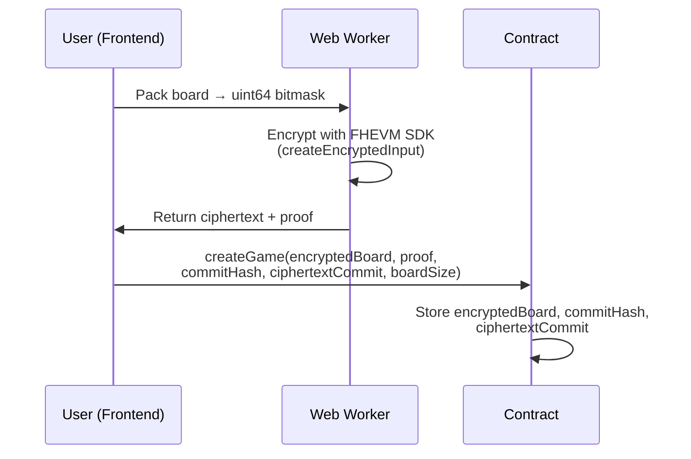
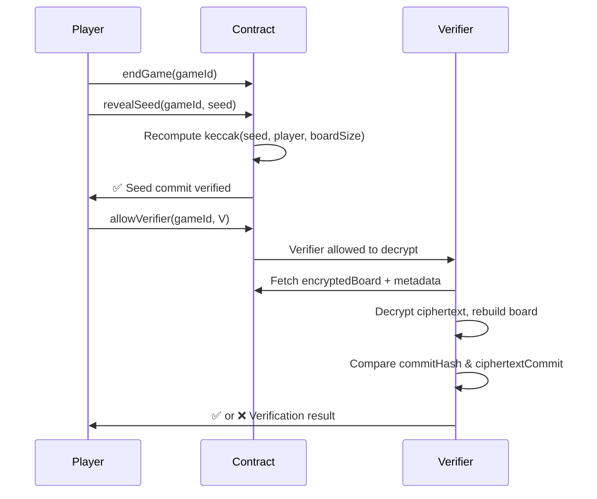
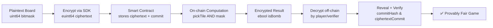

## Game Flow

```mermaid
flowchart TD
    A[Player Starts Game] --> B[Encrypt Board<br/>Pack bits + FHEVM]
    B --> C[Contract: createGame<br/>Store ciphertext + commits]
    C --> D[Player Picks Tiles<br/>pickTile(index)]
    D --> E[Contract: Extract Encrypted Bit]
    E --> F[Encrypted Result<br/>(safe/bomb)]
    F --> G[Gameplay Continues]
    G -->|Bomb or Cashout| H[endGame()]
    H --> I[revealSeed()]
    I --> J[Verifier Decrypts Ciphertext]
    J --> K[Compare Commit]
    K --> L[✅ Provably Fair]
```

---

## Encrypt Flow



---

## Decrypt & Verify Flow



---

## FHEVM Workflow



---

**Explanation:**

1. **Encrypt** — Player packs board → encrypts as `euint64`.
2. **Store** — Contract saves ciphertext + commitments.
3. **Compute** — Contract extracts bits with homomorphic ops.
4. **Decrypt** — Player/verifier decrypts result after end.
5. **Verify** — Check seed + ciphertextCommit → fairness guaranteed.