# 🎮 Confidential Mines

A **provably fair** blockchain game built on top of [Zama's FHEVM](https://zama.ai), where encryption meets on-chain
gaming.  
Players can enjoy a fun **Minesweeper-inspired** game while trusting that every outcome is **secure, private, and
verifiable**.

<p align="center">
  
</p>

## ✨ Features

- 🕹 **Minesweeper-style gameplay** — pick safe tiles, avoid bombs, climb to the top.
- 🔐 **Privacy by design** — game boards are encrypted using **Fully Homomorphic Encryption (FHE)**.
- ✅ **Provably fair** — players can independently verify that each game was created honestly.
- 🌐 **Decentralized** — runs on Ethereum Sepolia testnet, powered by smart contracts.
- 🦊 **MetaMask integration** — connect your wallet and start playing instantly.


# 🎮 Confidential Mines – Game Flow & Provably-Fair Mechanism

```mermaid
flowchart LR
    U[👤 User] --> W[🔑 Worker<br/>Encrypt Board]
    W --> C[⛓ Smart Contract<br/>FHE Commitment]
    C --> G[🎮 Gameplay<br/>Pick Tiles]
    G --> R[🔑 Reveal Seed + Board]
    R --> V[🔍 Verify Server<br/>Check Proof]
    V --> U
```



Unlike traditional Web3 games where servers can manipulate outcomes, **Confidential Mines** leverages **Zama’s FHEVM**
to guarantee both **privacy** and **fairness**.

---

## 🔑 Game Flow

### 1. Encrypted Game State

- The board (safe tiles + bombs) is encrypted using **FHE** before deployment.
- Even the blockchain and miners cannot see the contents.

### 2. On-chain Commitment

- When a player starts a game, the encrypted board is **committed on-chain**.
- This ensures no one (not even the developer) can alter the board after creation.

### 3. Gameplay

- The player interacts with the contract by picking **encrypted tiles**.
- The contract only accepts **valid ciphertext inputs**.

```solidity
function createGame(
    bytes[] calldata encryptedTiles,
    bytes calldata inputProof,
    bytes32 commitHash,
    uint8 boardSize
) external {
    require(encryptedTiles.length == boardSize, "Invalid board size");
    // FHE-specific check
    require(_isValidCiphertext(encryptedTiles, inputProof), "Invalid FHE input");
    ...
}
```

### 4. Provably-Fair Reveal

- At the end of the game (win or lose), the player reveals their **seed and board**:

```ts
await contract.revealSeed(gameId, seed);
await contract.revealGame(gameId, board);
```

- The contract ties the revealed data back to the original commit hash.

### 5. Proof JSON

- Each game generates a **proof JSON** (handles + inputProof + commitHash).
- Players can download this proof from transaction logs or contract events.

```json
{
  "encryptedTiles": ["0xabc...", "0xdef..."],
  "inputProof": "0x123...",
  "commitHash": "0x456..."
}
```

### 6. Independent Verification

- Anyone can run the **Verify Server** to confirm fairness

---

## 🔐 Why FHE Matters

Traditional Web3 games often face two major problems:

1. **Server-side trust**
   - Game logic may run off-chain, forcing players to trust the developer.
   - Sensitive state (like bomb positions) often remains hidden off-chain, breaking transparency.

2. **Limited fairness guarantees**
   - RNG can be weak or biased.
   - Players cannot always verify that the revealed state matches the committed one.

---

## 🚀 Confidential Mines with FHEVM

- **Encrypted state on-chain** — game boards are encrypted with FHE and committed directly into the contract.
- **Privacy + verifiability** — no one (not even miners or developers) can peek at the board, yet outcomes are still
  verifiable.
- **Mandatory encryption** — contract logic only works with ciphertext.
- **Provably fair by design** — the Verify Server proves that the revealed board matches the original encrypted
  commitment.

## ✨ With **Zama’s FHEVM**, Confidential Mines demonstrates a future of Web3 gaming where **privacy, fairness, and decentralization** work hand in hand.

## 🔑 Encryption via Worker

The encryption process is computationally heavy. To avoid blocking the UI, the board is encrypted inside a **Web
Worker** that loads the FHEVM SDK:

```js
/* eslint-disable no-undef */
importScripts("/fhevm-worker.js");

let fhevm = null;

self.onmessage = async (e) => {
  const { board, contractAddress, userAddress, sdkConfig } = e.data;

  try {
    const PossibleSDK = self.RelayerSDK || self.relayerSDK || self.fhevm || self.FHE || self.Zama;
    if (!PossibleSDK) throw new Error("FHE SDK global not found");

    if (!fhevm) {
      let instanceCreator;
      if (typeof PossibleSDK === "function") {
        const maybeNeedsInit = new PossibleSDK();
        if (typeof maybeNeedsInit.initSDK === "function") {
          await maybeNeedsInit.initSDK();
        }
        instanceCreator = maybeNeedsInit;
      } else {
        instanceCreator = PossibleSDK;
        if (typeof instanceCreator.initSDK === "function") {
          await instanceCreator.initSDK();
        }
      }
      fhevm = await instanceCreator.createInstance(sdkConfig);
    }

    const buf = fhevm.createEncryptedInput(contractAddress, userAddress);
    board.forEach((v) => buf.add32(BigInt(v)));
    const result = await buf.encrypt();

    self.postMessage({
      encryptedTiles: result.handles,
      inputProof: result.inputProof,
    });
  } catch (err) {
    self.postMessage({ error: err?.message || String(err) });
  }
};
```

This ensures:

- 🔄 **Non-blocking UI** — players can still interact with the game while encryption runs in background.
- ⚡ **Optimized performance** — heavy FHE operations are isolated from the main thread.
- 🔐 **Secure commitments** — encrypted inputs + inputProof are generated before submitting to the smart contract.

---

## 🌐 Demo

- 🎮 **Play the Game**: [confidential-mines.vercel.app](https://confidential-mines.vercel.app/)
- 🔎 **Verify Proofs**:
  [confidential-mines-verify.vercel.app/api/verify](https://confidential-mines-verify.vercel.app/api/verify)
- **Contract address (Sepolia Testnet)**:
  [0x3115579c839E357032dA49C4B3Bc33127eca474f](https://sepolia.etherscan.io/address/0x3115579c839E357032dA49C4B3Bc33127eca474f)

---

## 📡 Verify API

### Endpoint

```
POST https://confidential-mines-verify.vercel.app/api/verify
```

### Example Payload

```json
{
  "gameId": 1,
  "proofJson": {
    "board": [0, 1, 0, 0, 1, 0],
    "seed": 123456,
    "player": "0x1234...abcd",
    "boardSize": 6
  }
}
```

### Example Response

```html
<h2>✅ Verification Passed</h2>
<p>The decrypted board matches the committed on-chain state. The game is provably fair.</p>
```

If verification fails:

```html
<h2>❌ Verification Failed</h2>
<p>The provided proof does not match the on-chain commitment.</p>
```

---

## 🚀 Getting Started

### 1. Install dependencies

```bash
npm install
```

### 2. Set up environment variables

```bash
npx hardhat vars set PRIVATE_KEY
```

### 3. Compile and test

```
npx hardhat clean && npx hardhat compile
npx hardhat test
```

Example output:
````
✅ ABI copied to /Volumes/DATA/fhevm-mines/frontend/src/abi/ConfidentialMines.json
✅ ABI copied to /Volumes/DATA/fhevm-mines/backend/ConfidentialMines.json
````

### 4. Deploy contracts

```bash
# Local FHEVM-ready node
npx hardhat node

# Deploy contracts
npx hardhat deploy --network localhost
```

### 5. Play on Sepolia

```bash
npx hardhat deploy --network sepolia
```

Once deployed, connect MetaMask to **Sepolia Testnet** and start playing 🎉

---

## 🛠 Tech Stack

- **Smart Contracts**: Solidity + Hardhat
- **Frontend**: React + TypeScript + Ethers.js
- **Encryption**: [FHEVM](https://docs.zama.ai/fhevm) by Zama
- **Wallet**: MetaMask
- **Network**: Sepolia Testnet

---

## 🎮 Gameplay Enhancements

- **Bet & Cashout** — allow players to choose an initial stake and cash out based on the multiplier.

- **Automatic Verify UI** — build an interface where players can input a commit hash and seed to automatically
  reconstruct the entire game, enabling trustless verification by players or third parties.

- **Reputation & Leaderboards** — maintain transparent leaderboards based on multipliers, while keeping player
  identities private.

---

## 📚 Documentation

- [FHEVM Documentation](https://docs.zama.ai/fhevm)
- [FHEVM Solidity Guides](https://docs.zama.ai/protocol/solidity-guides/getting-started/setup)
- [Zama Discord Community](https://discord.gg/zama)

---

## 🌟 Credits

Built with ❤️ using **[Zama’s FHEVM](https://zama.ai)** — bringing **privacy-preserving smart contracts** to Ethereum.

> Confidential Mines is more than just a game — it’s a **demonstration of the future of Web3 gaming**, where **privacy,
> fairness, and decentralization** coexist.

---

## Contact

- GitHub: [https://github.com/phamnhungoctuan](https://github.com/phamnhungoctuan)
- Twitter: [https://x.com/tuanphamit](https://x.com/tuanphamit)
